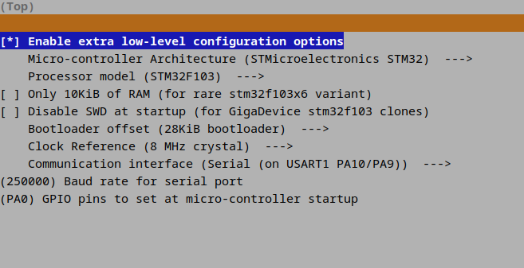

# Creality CR10 Smart configuration files for Klipper (https://github.com/Klipper3d/klipper)

Disclaimer: use it at your own risk!
I don't know what motherboard is installed inside your printer, the config is applicable for Creality CR10 Smart printer only with 'Creality v.45x motherboard (stm32f109 processor)'. The printer looks like https://www.creality.com/products/creality-cr-10-smart-3d-printer
If you have one of CR10 Mini, CR10, CR10S or CR10 Smart Pro printers please be aware: it's totally different printers! And my config will be useless for you.

Preamble: I use https://github.com/th33xitus/kiauh project for set up my PI and printer. It's very useful, indeed!

There are few configurations and manuals how to install Klipper on Creality CR10 Smart printer, like:
- https://forum.3dprintbeginner.com/t/creality-cr-10-smart-klipper-firmware-with-internal-creality-box/124
- https://github.com/shrimpyuk/CR-10-Smart-Klipper

but none of that helped me to know how to configure my printer.

So I tried to substitute pin name like 'PA1', 'PA2', 'PA..' into 'output_pin light' definition in klipper.cfg file and I tried to switch on and off light via Fluidd web interface.
And it was successfull on 'PA6' value! Next, I googled by something 'LIGHT_PIN PA6' or 'LED_PIN PA6' and I found this file: https://github.com/CR6Community/Marlin/blob/extui/Marlin/src/pins/stm32f1/pins_CREALITY_V45x.h
I have adopted pin names from the file to klipper configuration file and printer movements work as expected!

There were many issues with finding out settings for Auto Bed Leveling (ABL) sensor. This is not a BLTouch sensor, the sensor is looks like small pressure plate and is built inside a hotend.
So the sensor settings are completely different with comparsion to any BLTouch config that I've found online.
I tried to find out needed settings via 'parameters enumeration' way, like a blindy kitty and I found working solution.

And, of corse, there is my config settings for firmware:

So you may use my configs and enjoy!

Note: I upgraded my hotend to print high-temperature plastics (only replaced stock throat by this https://www.amazon.com/Heatbreak-Titanium-Temperature-Compatible-Anycubic/dp/B09P1H24R3) so I set the maximum hotend temperature for my printer to 300 celcium degrees.
If you don't have these improvements, please set 'max_temp: 260' (the stock value) in config/020-extruder.cfg file to prevent from breaking the teflon tube inside the hotend.

P.S. The stock touchscreen is completely useless after flashing the Klipper firmware, as it freezes when starting the printer. So I'm also watching for these links:
- https://github.com/Desuuuu/DGUS-reloaded-Klipper
- https://github.com/Desuuuu/klipper
- https://klipper.discourse.group/t/feature-request-extend-protocol-with-uart-commands/2414/3

And I'm waiting when some of ideas will be included in mainstream repo (I'd like to prefer mainstream repo as the repo has more updates on everyday basis). Unfortunately, no any activities at this directions, but finger crossed, yeah...
